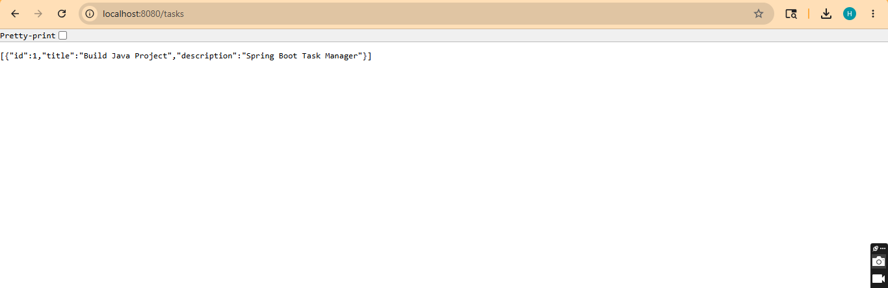
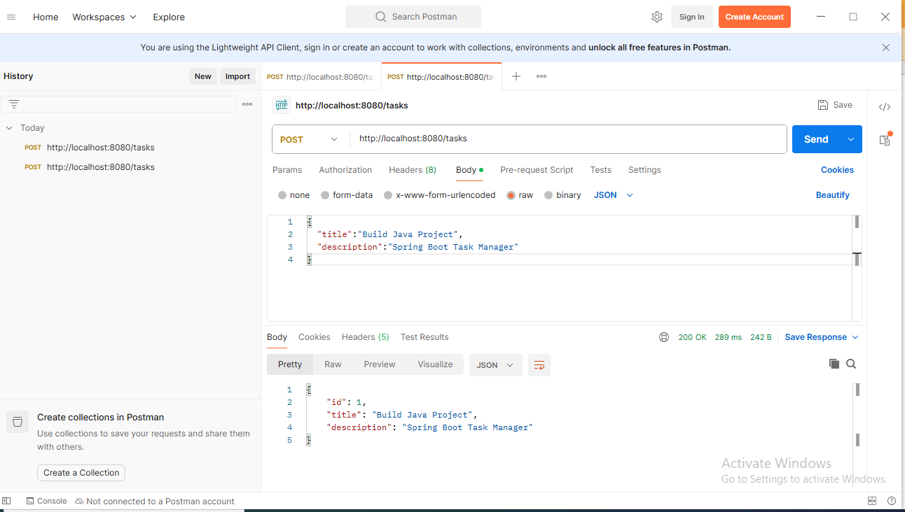
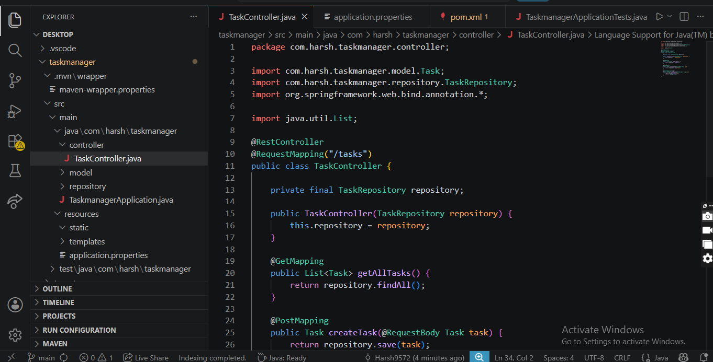

# Task Manager API

A simple Task Manager REST API built using Java Spring Boot.

---

## Features

* Add Task
* View All Tasks
* Delete Task

---

## Tech Stack

* Java
* Spring Boot
* Spring Data JPA
* H2 Database
* Maven

---

## API Endpoints

### Get All Tasks

GET /tasks

### Create Task

POST /tasks

### Delete Task

DELETE /tasks/{id}

---

## Sample JSON Request

```json id="8y1zwm"
{
  "title": "Build Java Project",
  "description": "Spring Boot Task Manager"
}
```

---

## Run Project

```bash id="4yjlwm"
.\mvnw spring-boot:run
```

---

## Application URL

http://localhost:8080/tasks

---

## Screenshots

### API Output



### Postman Testing



### Project Structure



---

## Author

Harsh Kumar
